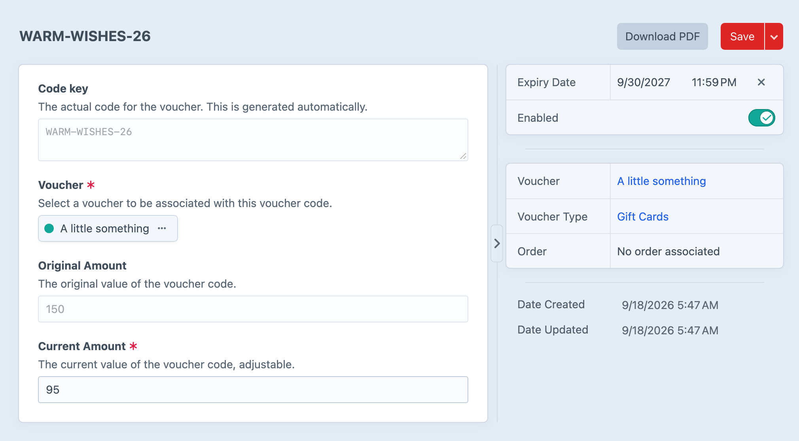
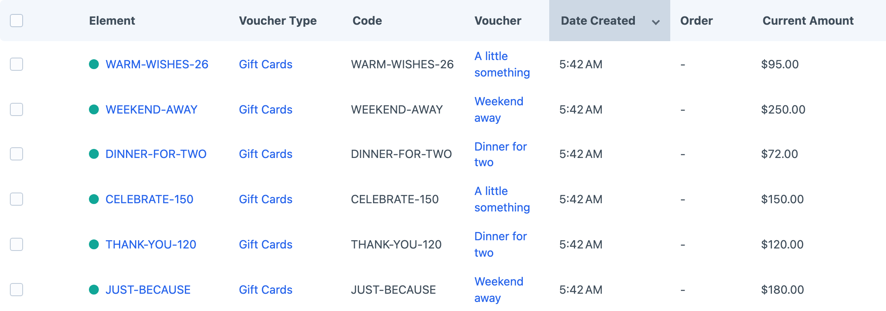

<!-- feature-intro -->
Let customers purchase digital gift vouchers and redeem them during Craft Commerce checkout. Offer fixed or custom values, deliver branded PDFs, and keep track of every redemption. Requires Craft Commerce Pro.
<!-- feature-intro-end -->

<!-- feature-section -->
## Voucher types

Group vouchers into types — much like Commerce product types — with their own custom fields, templates and URL formats. Offer fixed prices or let customers choose an amount, then use the familiar cart, checkout and order workflows already in the store.

<!-- feature-section-end -->

<!-- feature-grid -->
- :icon[files] **Multiple vouchers** Let more than one voucher contribute to an order, alongside Commerce coupons where applicable.
- :icon[calendar-time] **Optional expiry** Set expiry rules globally or adjust them for an individual code.
- :icon[truck-delivery] **Shipping categories** Treat digital vouchers appropriately when a cart also contains physical products.
<!-- feature-grid-end -->

<!-- feature-section media-size="large" -->
## Intelligent redemptions

A voucher contributes only what the order needs. If its balance is larger than the order, the remainder stays available for next time; if it falls short, the customer simply pays the difference.

<!-- feature-section-end -->

<!-- feature-grid -->
- :icon[history] **Redemption history** See the related order, amount and date every time a code is used.
- :icon[terminal-2] **Manual codes** Create voucher codes in the control panel for customer service or special occasions.
- :icon[copy-plus] **Bulk code generation** Create a nominated quantity of codes for a voucher in one control-panel operation.
- :icon[edit] **Staff adjustments** Update balances, expiry dates and redemption state when support work calls for it.
<!-- feature-grid-end -->

<!-- feature-section media-size="large" -->
## Every code in one place

See active codes, their voucher type, current balance and expiry date from one searchable index. Open any code to make a support adjustment without losing sight of the value it started with.

<!-- feature-section-end -->

<!-- feature-section media-size="large" media-shadow="false" -->
## Generate PDF vouchers

Generate downloadable voucher PDFs from project-owned Twig templates and include the code, value and presentation your customers need. Attach them automatically to nominated Craft Commerce emails, or make them available for download after purchase. Starter templates and practical template guides provide a useful baseline without locking the finished design to the plugin.

<!-- feature-section-end -->
